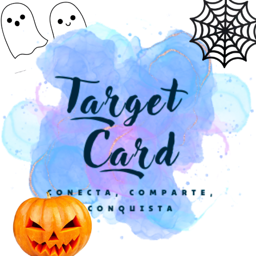

# Halloween Edition - Target Card 🎃👻

**Target Card** es un proyecto que busca modernizar el uso de tarjetas de presentación mediante la integración de tecnología NFC y perfiles digitales personalizados. Para el hackatón de Cloudinary con temática de Halloween, se desarrolló una sección especial que permite explorar cómo podrían personalizarse las tarjetas con diseños festivos.

## Descripción General

El proyecto **Target Card** surge como una solución para crear perfiles digitales fácilmente accesibles mediante tarjetas NFC, que se pueden compartir rápidamente acercándolas a un dispositivo compatible. Como parte del hackatón, se implementó una edición de Halloween, mostrando cómo es posible usar las capacidades de Cloudinary para mejorar la experiencia de personalización de las tarjetas, ofreciendo una variedad de opciones con temática de terror.

El objetivo es ofrecer un caso de uso real donde los usuarios podrían elegir entre diferentes diseños para sus tarjetas, todo gestionado de manera eficiente gracias a la integración con Cloudinary.

## Halloween Edition 🎃

Durante este hackatón, se desarrolló una sección de **Target Card** dedicada a la temporada de Halloween, donde se aprovecha Cloudinary para almacenar, optimizar y manipular imágenes. Desde fantasmas hasta calabazas, se puede visualizar cómo quedarían estos diseños aplicados a las tarjetas NFC.

Además de ser una propuesta para el hackatón, esta sección está pensada para escalar el proyecto, aportando beneficios a la plataforma real.

## ¿Qué hace Target Card?

**Target Card** ofrece una plataforma que permite a las personas crear **perfiles digitales personalizados** y asociarlos a tarjetas físicas con tecnología NFC. Entre las funcionalidades actuales de la plataforma se incluyen:

- **Perfil Digital Personalizado**: Los usuarios pueden crear un perfil donde agregar y organizar enlaces a redes sociales, portafolios, blogs y otros recursos en línea, todo en un solo lugar.

- **Tarjetas NFC**: Las tarjetas físicas personalizadas con NFC permiten compartir de manera rápida el perfil digital. Al acercar la tarjeta a un dispositivo compatible, se abre automáticamente el perfil del usuario.

- **Diseño Personalizado de Tarjetas**: La plataforma ofrece opciones de personalización gráfica para las tarjetas, permitiendo a los usuarios diseñar su tarjeta con sus propios estilos y preferencias. Desde colores hasta logotipos y gráficos, cada tarjeta es única.

- **Proceso de Personalización Simplificado**: Los usuarios pueden trabajar directamente con el creador para definir el diseño de su tarjeta antes de su impresión, facilitando un proceso de personalización que se adapta a las necesidades de cada cliente.

- **Impresión y Envío**: Las tarjetas se imprimen y se envían a los usuarios una vez que el diseño está aprobado, listas para ser usadas en eventos, reuniones o de manera cotidiana.

## Tecnologías Utilizadas

- **Cloudinary**: Utilizado para manejar y optimizar imágenes, garantizando una experiencia fluida y eficaz al seleccionar y personalizar diseños.
- **React.js** y **Node.js**: El stack principal para el desarrollo tanto del frontend como del backend.
- **NFC**: Para el intercambio instantáneo de perfiles digitales mediante tarjetas físicas.

## Caso Real

La idea detrás de esta sección para el hackatón no es solo una prueba de concepto, sino una visión realista de cómo **Target Card** podría funcionar en el futuro, facilitando la personalización de tarjetas y aprovechando la infraestructura de Cloudinary. Esta integración muestra el potencial de la plataforma Cloudinary para ofrecer una experiencia amigable y moderna.

## Contacto

Para más información o para conocer más sobre el proyecto, se puede contactar a través de:

- **Correo**: [contacto@targetcard.com.mx](mailto:contacto@targetcard.com.mx)
- **Instagram**: [@targetcard_oficial](https://instagram.com/targetcard_oficial)
